# Signal & Background Modeling and Statistical Inference in `diamx`

**Minghao Liu**

[TOC]

In `diamx`, we implement complete background and signal models for the XENONnT [[1]](#xenonnt_sr0) [[2]](#xenonnt_sr1), LUX-ZEPLIN (LZ) [[3]](#lz_ws2022) [[4]](#lz_ws2024), and PandaX-4T [[15]](#pandax_prl) [[16]](#pandax_prd) experiments. This note describes how these models are constructed and implemented.

The note is divided into four sections. The first section describes how the ER and NR events are modeled using parametrized models with `appletree` and `nest`. The second section describes the contour-driven treatment for data-driven background components, such as accidental coincidence (AC) and surface events. The third section is devoted to the construction of confidence intervals and discovery significances with asymptotic equations. The last section explains experiment-specific configurations, and uses spin-independent WIMP model to demonstrate how `diamx` reproduces the confidence intervals of WIMP-nucleon cross sections in literature.

## History of this note

This note is maintained alongside the `diamx` package; its major revisions are summarized below.

| Date         | Version      | Update                                                                                                                                                                                                                          |
| ------------ | ------------ | ----------------------------------------------------------------------------------------------------------------------------------------------------------------------------------------------------------------------------------- |
| 2025-11-11   | v0.2.0       | Initial note: ER/NR and data-driven background modeling, the profiled-likelihood inference framework, and the XENONnT (SR0, SR1) and LZ (WS2022, WS2024) experiment models. (First drafted 2025-06-15.)                          |
| 2026-06-07   | unreleased   | Added the PandaX-4T Run0 & Run1 model: micro-physics (P4-NEST), detector response (including the per-run electron-lifetime treatment), efficiency, the contour-band AC template, and the experiment-specific section, with references [[15]](#pandax_prl) [[16]](#pandax_prd). |

## Modeling ER and NR Events with `appletree` or `nest`

One important feature for dual-phase liquid xenon time projection chambers is that one event produces two signals, a prompt scintillation light signal (S1) and a delayed ionization signal (S2). This gives the detector the discrimination power between electronic recoil (ER) events and nuclear recoil (NR) events by using S1 to S2 ratio, which cannot be reflected in a 1-dimensional model that depends only on energy.

A realistic model for ER and NR events should predict the distribution of background or signal events in the corrected S1 and S2 space (cS1-cS2 in XENONnT language, or S1c-S2c in LZ language). It usually comprises three modules:

1. **Micro-physics model**: Converts deposited energy into numbers of scintillation photons and ionization electrons.
2. **Detector response model**: Simulates photon/electron transport, S1/S2 signal formation and corrections, and reconstruction biases.
3. **Efficiency model**: Accounts for various effects that may lead to event loss, such as S1 reconstruction and selection criteria.

We use the package `appletree` to construct models for XENONnT and PandaX-4T, and the package `nest` for LZ. This section describes the three modules defined in `diamx`.

### Micro-physics Model

XENONnT, LZ, and PandaX-4T all use NEST-based parametrizations, which use a series of parameters to construct a model for liquid xenon scintillation yields. In order to match calibration data, each experiment adjusts the micro-physics parameters from the default parameters, and these parameters are mostly available in literature.

#### XENONnT Micro-physics

XENONnT SR0 used the so-called NEST v1 parametrization, as detailed in Appendices A and B of [[5]](#xenonnt_analysis_paper_two).  ER and NR emission parameters are taken from the marginal posteriors in Table II of [[5]](#xenonnt_analysis_paper_two). While the ER model is fully implemented via `appletree`, custom implementation is needed in `diamx.appletree` to match the same NEST v1 behavior for NR events.

In the combined result of SR0 & SR1, the XENON collaboration used the updated NEST v2 parametrization [[2]](#xenonnt_sr1). However, the micro-physics parameters are not yet published. Since we do not expect the micro-physics to change by much for the same detector and electric field, and that the NR contours can be reproduced reasonably well with NEST v1, we stick with using NEST v1 for XENONnT SR1 results.

The micro-physics parameters used in `appletree` is listed in Table 1.1.

**Table 1.1**: Micro-physics parameters used in XENONnT SR0 & 1 model in `diamx`. These parameters the marginal posteriors in Table II of [[5]](#xenonnt_analysis_paper_two).

| Parameter (name in `diamx`/`apppletree`) | Value   | Unit |
| ---------------------------------------- | ------- | ---- |
| $W$ (`w`)                                | $13.7$  | eV   |
| $f$ (`fano`)                             | $0.059$ | --   |
| $<N_{ex}/N_{i}>$ (`nex_ni_ratio`)        | $0.13$  | --   |
| $\gamma$ (`py0`)                         | $0.13$  | --   |
| $\delta$ (-`py2`)                        | $0.34$  | --   |
| $\omega$ (`py1`)                         | $57$    | keV  |
| $q_0$ (`py3`)                            | $1.32$  | keV  |
| $q_1$ (`py4`)                            | $0.47$  | keV  |
| $q_2$ (`rf0`)                            | $0.030$ | --   |
| $q_3$ (`rf1`)                            | $0.47$  | keV  |
| $\zeta$ (`zeta`)                         | $0.047$ | --   |
| $\delta$ (`delta`)                       | $0.062$ | --   |
| $\alpha$ (`alpha`)                       | $0.92$  | --   |
| $\gamma$ (`gamma`)                       | $0.016$ | --   |
| $\beta$ (`beta`)                         | $334$   | --   |
| $\kappa$ (`kappa`)                       | $0.138$ | --   |
| $\eta$ (`eta`)                           | $10.0$  | --   |
| $\lambda$ (`lambda`)                     | $1.40$  | --   |

#### LZ Micro-physics

We use `nest` v2.4.0 to model micro-physics for both LZ results (WS2022 & WS2024). The LZ collaboration has published two header files that can be used to reproduce the model for WS2022 & WS2024 results [[3]](#lz_ws2022) [[4]](#lz_ws2024), and `diamx` follows the recommendations given by the two files. Some custom implementation was added in `diamx.nest` to model both detectors at once and to model the lower charge yield for electron-capture and double electron capture events for xenon isotopes.

**Table 1.2**: Micro-physics parameters used in XENONnT WS2022 & WS2024 model in `diamx`. These parameters come from the header files listed in literature [[3]](#lz_ws2022) [[4]](#lz_ws2024). The notations for parameter names follow [[6]](#nest_paper).

| Parameter (name in `diamx`/`nest`)              | Value (LZ WS2022)                               | Value (LZ WS2024) | Unit   |
| ----------------------------------------------- | ----------------------------------------------- | ----------------- | ------ |
| $\alpha$ (`NRYieldsParam[0]`)                   | $11$                                            | $10.19$           | --     |
| $\beta$ (`NRYieldsParam[1]`)                    | $1.1$                                           | $1.11$            | --     |
| $\gamma$ (`NRYieldsParam[2]`)                   | $0.0480$                                        | $0.0498$          | --     |
| $\delta$ (`NRYieldsParam[3]`)                   | $-0.0533$                                       | $-0.0533$         | --     |
| $\epsilon$ (`NRYieldsParam[4]`)                 | $12.6$                                          | $12.46$           | keV    |
| $\zeta$ (`NRYieldsParam[5]`)                    | $0.3$                                           | $0.2942$          | keV    |
| $\eta$ (`NRYieldsParam[6]`)                     | $2$                                             | $1.899$           | --     |
| $\theta$ (`NRYieldsParam[7]`)                   | $0.3$                                           | $0.3197$          | keV    |
| $\iota$ (`NRYieldsParam[8]`)                    | $2$                                             | $2.066$           | --     |
| $p$ (`NRYieldsParam[9]`)                        | $0.5$                                           | $0.509$           | --     |
| `NRYieldsParam[10]`                             | $1$                                             | $0.996$           | --     |
| `NRYieldsParam[11]`                             | $1$                                             | $0.999$           | --     |
| $m_1$ (`ERYieldsParam[0]`)                      | $-1$ (field dependent)                          | $12.4886$         | e-/keV |
| $m_2$ (`ERYieldsParam[1]`)                      | $-1$ ($77.2931084$)                             | $85.0$            | e-/keV |
| $m_3$ (`ERYieldsParam[2]`)                      | $-1$ (field dependent)                          | $0.6050$          | keV    |
| $m_4$ (`ERYieldsParam[3]`)                      | $-1$ (field dependent)                          | $2.14687$         | --     |
| $m_5$ (`ERYieldsParam[4]`)                      | $-1$ (energy, $\alpha$, $N_q$, $m_1$ dependent) | $25.721$          | e-/keV |
| `ERYieldsParam[5]`                              | $-1$                                            | $-1.0$            | --     |
| $m_7$ (`ERYieldsParam[6]`)                      | $-1$ (field dependent)                          | $59.651$          | keV    |
| $m_8$ (`ERYieldsParam[7]`)                      | $-1$ ($4.285781736$)                            | $3.6869$          | --     |
| $m_9$ (`ERYieldsParam[8]`)                      | $-1$ ($0.3344049589$)                           | $0.2872$          | --     |
| $m_{10}$ (`ERYieldsParam[9]`)                   | $-1$ (field dependent)                          | $0.1121$          | --     |
| $f_{i}$ (`NRERWidthsParam[0]`)                  | $0.4$                                           | $0.404$           | --     |
| $f_{ex}$ (`NRERWidthsParam[1]`)                 | $0.4$                                           | $0.393$           | --     |
| $A$ (NR) (`NRERWidthsParam[2]`)                 | $0.04$                                          | $0.0383$          | --     |
| $\xi$ (NR) (`NRERWidthsParam[3]`)               | $0.5$                                           | $0.497$           | --     |
| $\omega$ (NR) (`NRERWidthsParam[4]`)            | $0.19$                                          | $0.1906$          | --     |
| $\alpha_p$ (`NRERWidthsParam[5]`)               | $2.25$                                          | $2.220$           | --     |
| $\delta_F$ or $F_q$ (ER) (`NRERWidthsParam[6]`) | $-0.0015$ ($\delta_F$)                          | $0.3$ ($F_q$)     | --     |
| `NRERWidthsParam[7]`                            | $0.046452$                                      | $0.04311$         | --     |
| $\omega$ (ER) (`NRERWidthsParam[8]`)            | $0.205$                                         | $0.15505$         | --     |
| $\xi$ (ER) (`NRERWidthsParam[9]`)               | $0.45$                                          | $0.46894$         | --     |
| $\alpha_p$ (`NRERWidthsParam[10]`)              | $-0.2$                                          | $-0.26564$        | --     |

Note:

* `NRYieldsParam[10]` and `NRYieldsParam[11]` are extra exponents in equation (12) and (13) of [[6]](#nest_paper), acting on $(1+(E/\zeta)^{\eta})$ or $(1+(E/\theta)^{\iota})$.
* `ERYieldsParam[5]` acts as a switch to toggle the density and W corrections. $-1$ means turning on the toggling.
* `NRERWidthsParam[7]` enters the calculation of $A$ for ER.

#### PandaX-4T Micro-physics

PandaX-4T uses its own NEST-based signal-response model, detailed in [[16]](#pandax_prd). Unlike for XENONnT and LZ, this model is not distributed as a ready-to-use parametrization, so `diamx.appletree` re-implements it as a set of custom plugins (`p4_nest`). The mean yields follow [[16]](#pandax_prd): NR light and charge yields from Eq. (A2), and ER yields from Appendix A1, which is the PandaX transcription of the NEST v2.0 beta model [[6]](#nest_paper). Checked against that source, the A1 ER charge yield is correct as printed except for one typo in the Doke-Birks term, where the numerator $1.145935\times10^{10}$ should read $1.415935\times10^{10}$ (a $\lesssim 0.5\%$ effect on $Q_y$ near 25 keV), which we correct. A1 additionally writes the exciton-to-ion coefficient and $\langle N_i\rangle = 1000\,\xi/(W\alpha)$ differently from the source, but these affect only the ion/exciton split, not the mean charge yield. We use a fixed work function $W$, following A1. The recombination fluctuation $\Delta r$ uses the skew-Gaussian in the quenched electron fraction $\zeta=\langle N_e\rangle/\langle N_q\rangle$ from Appendix A1/A2.

On top of the mean recombination, PandaX applies an energy-dependent correction (Eq. (17) of [[16]](#pandax_prd)):
$$
\langle r\rangle = \mathrm{clip}\!\left(\langle r\rangle_0 + P_3(\xi/\xi_{\mathrm{norm}})\,e^{-\xi/\xi_{\mathrm{norm}}} + d,\; 0,\; 1\right),
$$
where $P_3$ is a third-order Legendre polynomial with coefficients $p_0\ldots p_3$, $\xi$ is the recoil energy, and $d$ is a per-run shift; the fluctuation is scaled as $\Delta r = a\,\Delta r_0$. We treat $\xi_{\mathrm{norm}}$ as a reparametrization and use $\xi_{\mathrm{norm}}^{\mathrm{ER}}=30$ keV and $\xi_{\mathrm{norm}}^{\mathrm{NR}}=150$ keV (the Eq. (17) NR entry of 30 keV overshoots and is treated as a typo).

Rather than adopting the published Table II coefficients (which carry $\pm 50$–$100\%$ uncertainties and are degenerate), we fit $p_0\ldots p_3$ directly to the digitized yield curves of Fig. 17 of [[16]](#pandax_prd). For NR the published yields only reach $\sim 79$ keV (cS1 $\sim 115$), whereas the NR median band extends to cS1 $\sim 134$; we therefore fit the NR coefficients **jointly** to the Fig. 17 LY/QY and to the published NR-median locus at high cS1, which constrains the high-energy charge-to-light ratio that is otherwise extrapolated. The fit is analytic (anchored and verified against Monte-Carlo); the full procedure is documented in `notebooks/pandax4t_yields.ipynb`. The resulting model reproduces the Fig. 17 light yield, charge yield, and recombination fluctuation to better than $\sim 1\%$, and the NR median / ER band to the published curves (see Fig. 4.10).

The micro-physics parameters used in `appletree` are listed in Table 1.4.

**Table 1.4**: PandaX-4T micro-physics parameters used in `diamx`. The functional forms follow [[16]](#pandax_prd); the recombination-correction coefficients are fit to the Fig. 17 yield curves (and, for NR, the NR median) as described above.

| Parameter (name in `diamx`)                  | Value                                   | Unit  |
| -------------------------------------------- | --------------------------------------- | ----- |
| $W$ (`w`)                                    | $13.7$                                  | eV    |
| $\rho_{\mathrm{Xe}}$ (`liquid_xe_density`)   | $2.8619$                                | g/cm³ |
| $\xi_{\mathrm{norm}}^{\mathrm{ER}}$ (`xi_norm_er`) | $30$                              | keV   |
| $\xi_{\mathrm{norm}}^{\mathrm{NR}}$ (`xi_norm_nr`) | $150$                             | keV   |
| ER $p_0\ldots p_3$ (`p{0..3}_er`)            | $[0.237, -0.422, 0.377, -0.099]$        | --    |
| ER $d$ (`d_er`), Run0 / Run1                 | $0$ / $-0.029$                          | --    |
| ER $a$ (`a_er`)                              | $1.11$                                  | --    |
| NR $p_0\ldots p_3$ (`p{0..3}_nr`), Run0      | $[0.690, -1.495, 1.230, -0.589]$        | --    |
| NR $p_0\ldots p_3$ (`p{0..3}_nr`), Run1      | $[0.523, -0.981, 0.926, -0.330]$        | --    |
| NR $d$ (`d_nr`), Run0 / Run1                 | $0$ / $-0.031$                          | --    |
| NR $a$ (`a_nr`)                              | $1.06$                                  | --    |

### Detector Response Model

A typical detector model includes the following effects:

* S1-related effects:
  * $(x, y, z)$-dependent correction for signal loss from photon transportation.
  * Double photo-electron emission (DPE) effect.
  * S1 reconstruction bias.
* S2-related effects:
  * $(x, y)$-dependent correction for signal loss from electron extraction and photon transportation.
  * $z$-dependent correction for signal loss from electron absorption or charge-insensitive volume.
  * Double photo-electron emission (DPE) effect.
  * S2 reconstruction bias.

The detector model for XENONnT SR0 is explained in Appendix C of [[5]](#xenonnt_analysis_paper_two). Since corrections and reconstruction biases are not available for both XENONnT and LZ, we disabled these two effects in `diamx`.

The model is implemented fully in `appletree` and `nest`. The relevant detector parameters, like $g_1$, $g_2$ (photon and electron gain), single electron gain, probability of double PE emission, etc., can be found either in literature or the packages.

However, it is worth noting that for XENONnT SR1, we adjusted $g_2$ as a free parameter in order to match the published contour benchmarks. The $g_2$ that matched best with contours was $15.8\,\mathrm{PE/electron}$ , which does not agree with the published result $(16.9 \pm 0.5)\, \mathrm{PE/electron}$ . This discrepancy is likely because SR1 lacked a ${}^{37}$Ar calibration point to anchor low-energy behavior.

Table 1.3 lists the detector parameters used in XENONnT SR0 & SR1 detector model and their sources. The detector parameters for LZ are listed in the header files provided in [[3]](#lz_ws2022) and [[4]](#lz_ws2024).

**Table 1.3**: Detector parameters used in XENONnT SR0 & SR1.

| Parameter                | SR0                                                      | SR1                                                      |
| ------------------------ | -------------------------------------------------------- | -------------------------------------------------------- |
| Photon gain $g_1$        | $0.151\,\mathrm{PE/photon}$ [[1]](#xenonnt_sr0)          | $0.1367\,\mathrm{PE/photon}$ [[2]](#xenonnt_sr1)         |
| Electron gain $g_2$      | $16.5\,\mathrm{PE/electron}$ [[1]](#xenonnt_sr0)         | $15.8\,\mathrm{PE/electron}$ [[2]](#xenonnt_sr1)         |
| Single electron gain $G$ | $31.2\,\mathrm{PE/electron}$ [[2]](#xenonnt_sr1)         | $29.4\,\mathrm{PE/electron}$ [[2]](#xenonnt_sr1)         |
| Drift velocity           | $0.0677\, \mathrm{cm/\mu s}$ (source: `appletree` value) | $0.0677\, \mathrm{cm/\mu s}$ (source: `appletree` value) |
| Electric field           | $23\, \mathrm{V/cm}$ [[1]](#xenonnt_sr0)                 | $23\, \mathrm{V/cm}$ [[2]](#xenonnt_sr1)                 |
| Probability of DPE       | $0.227$ (source: `appletree` value)                      | $0.227$ (source: `appletree` value)                      |

The PandaX-4T detector model is also implemented in `appletree`. PandaX reconstructs in the $(cS1, \log_{10}(cS2_b/cS1))$ space, where $cS2_b$ is the *bottom*-array S2 and the second axis is a *ratio* — in contrast to the absolute $cS2$ used by XENONnT and the $S2c$ used by LZ. The corresponding gains $g_1$ and $g_{2b}$ differ between Run0 and Run1 and are taken from [[16]](#pandax_prd) (the values quoted in [[15]](#pandax_prl) agree to $\lesssim 1\%$). One PandaX-specific reconstruction addition is the hit-clustering loss (Eq. (9) and Fig. 6 of [[16]](#pandax_prd)), in which detected S1 hits can be lost during clustering with an energy/hit-count-dependent probability.

Unlike for XENONnT and LZ, we keep a finite, position- and time-dependent **electron lifetime**, because it is the dominant contributor to the width of the ER/NR bands here. Each simulated event draws an electron lifetime from the per-run distribution digitized from Fig. 1 of [[16]](#pandax_prd) (stored as an inverse-CDF / quantile map, `pandax4t_run{0,1}_elife.json`, built in `notebooks/pandax4t_maps.ipynb`); the resulting binomial charge loss — a mean of $\sim 30\%$ over the $\sim 120$ cm drift, with the charge-survival correction dividing out only the *mean* — broadens the bands by the right amount. The drift velocities are set so that the maximum drift time matches the PandaX values ($\sim 820\,\mu$s for Run0 and $\sim 900\,\mu$s for Run1, the latter having a lower drift field). Detector parameters are listed in Table 1.5.

**Table 1.5**: Detector parameters used in the PandaX-4T Run0 & Run1 model.

| Parameter                  | Run0                                       | Run1                                       |
| -------------------------- | ------------------------------------------ | ------------------------------------------ |
| Photon gain $g_1$          | $0.0997\,\mathrm{PE/photon}$ [[16]](#pandax_prd) | $0.0907\,\mathrm{PE/photon}$ [[16]](#pandax_prd) |
| Bottom-S2 gain $g_{2b}$    | $4.12\,\mathrm{PE/electron}$ [[16]](#pandax_prd) | $5.03\,\mathrm{PE/electron}$ [[16]](#pandax_prd) |
| Single-electron gain $G$   | $5.5\,\mathrm{PE/electron}$ (source: `appletree` placeholder) | $5.5\,\mathrm{PE/electron}$ (source: `appletree` placeholder) |
| Drift velocity             | $0.146\,\mathrm{cm/\mu s}$                  | $0.133\,\mathrm{cm/\mu s}$                  |
| Max drift time             | $\sim 820\,\mu\mathrm{s}$                   | $\sim 900\,\mu\mathrm{s}$                   |
| Electron lifetime          | $\sim 400$–$1700\,\mu\mathrm{s}$ (median $\sim 1150$) [[16]](#pandax_prd) | $\sim 500$–$1760\,\mu\mathrm{s}$ (median $\sim 1550$) [[16]](#pandax_prd) |
| Drift field                | $93\,\mathrm{V/cm}$ [[16]](#pandax_prd)    | $84\,\mathrm{V/cm}$ [[16]](#pandax_prd)    |
| Probability of DPE         | $0.22$ (source: `appletree` value)         | $0.22$ (source: `appletree` value)         |

### Efficiency Model

In the literature, efficiency is usually shown as a function of NR energy, and the ER efficiency model is not generally available. For example, for XENONnT SR0 the efficiency is shown in Fig. 1.1 (Fig. 2 in [[1]](#xenonnt_sr0)), where the blue curve is used in `diamx` efficiency model.

|  |
| :----------------------------------------------------------: |
| Fig. 1.1: Detection and selection efficiency for NR events in this search as a function of the NR recoil energy. The total efficiency in the WIMP search region (black) is dominated by the detection efficiency (green) at low energies and event selections (blue) at higher energies until the edge of the ROI. Normalized recoil spectra for WIMPs with masses of 10, 50, and 200  GeV/c${}^2$ are shown with orange dashed lines for reference. |

The publicly available data do not suffice to construct a complete efficiency model even for NR events, because the efficiency of events with the same energy can in principle depend on S1 / S2 area. We have to make a series of simplifications, and only consider two factors: 

- S1 reconstruction efficiency;
- Event-building + selection efficiency.

**For ER events:** 

* For XENONnT we model the S1 reconstruction efficiency as a function of detected S1 photons using the map from Fig. 5 of [[7]](#xenonnt_analysis_paper_one) (listed as Fig. 1.2 in this note), while for LZ no extra model is applied other than the default model in `nest`. 
* For both experiments we assume that the event-building + selection efficiency is flat in energy. The exact value of the flat efficiency does not matter because we need to normalize the entire template by the input background rate.

|  |
| :----------------------------------------------------------: |
| Fig. 1.2: S1 reconstruction efficiency as a function of number of detected photons for XENONnT SR0. The red and blue markers show the median detection efficiency for both data-driven and simulation methods. The gray band below three photons detected marks the undefined region for S1 when requiring a tight coincidence of at least three PMTs. The uncertainty for the data-driven method is mainly a combination of data-selection bias, energy, and position dependence of S1 pulse shape together with statistical uncertainty. The uncertainty for the waveform simulation method is dominated by position dependence in the S1 pulse shape. The final results are based on waveform simulation, while the data-driven method serves as a cross-check. |

**For NR events:** 

* We still use the same model for S1 reconstruction efficiency.

* However, the event-building + selection efficiency is more complicated. The input we use is the total efficiency curve as a function of NR energy **without region of interest (ROI) selection** (blue curve in Fig. 1.1), as `diamx` applies the ROI when producing the template. While for LZ it suffices to apply the total efficiency directly to NR signal events, for XENONnT special treatment is needed. This is because the S1 reconstruction efficiency is already included in the total efficiency extracted from literature. In addition, the S1 reconstruction efficiency and the total efficiency does not act on the same parameter space: the former acts on number of detected S1 photons, while the latter acts on NR energy. To avoid double-counting, we need to assume that the two efficiencies are independent, and then decompose the total efficiency into the two parts mentioned above by the following steps:

  1. Use `appletree` to map the S1-reconstruction efficiency vs detected S1 photons into a function of NR energy.  

  2. Divide the published total efficiency by this reconstructed S1 reconstruction efficiency component to isolate the event-building + selection efficiency. 

  3. Apply both effects independently in `diamx`.

**For PandaX-4T**, more efficiency information is published, so the model is more complete (PRD Eq. (16) of [[16]](#pandax_prd)). The per-event acceptance is the product of the S1 and S2 cut acceptances (Fig. 12 of [[16]](#pandax_prd)), a residual energy-dependent quality acceptance $r(\xi)$ that carries the low-energy quality turn-on and a $\sim 5\%$ plateau loss not captured by the S1/S2 cut acceptances, and a reconstruction efficiency $\varepsilon_{\mathrm{recon}}(\xi)$ (Fig. 15 of [[16]](#pandax_prd)). All four curves are run- and recoil-specific and are digitized in `notebooks/pandax4t_efficiency.ipynb`; the hit-clustering loss (Section above) enters separately at the detector stage. The single-scatter requirement and the region-of-interest selection are handled elsewhere (the latter by the analysis-space binning).

## Modeling Data-driven Backgrounds with a Gaussian-Like / Piecewise-Uniform Profile

Some background components, such as accidental coincidence and surface events, rely on data-driven PDFs that are not publicly available. Usually, in publications only the $1\sigma$ and $2\sigma$ contours can be extracted, which is not enough to specify a full 2D PDF. In `diamx` we try to reconstruct a plausible background template by assuming a two-parameter family of PDF shapes, so that the two published contours uniquely fix all remaining degrees of freedom.

With minimal knowledge we can assume two types of PDF profiles: one is a Gaussian-like profile, and the other is a piecewise-uniform profile. The Gaussian-like profile is ideal for producing a smooth, continuous PDF with a single peak, while the piecewise-uniform profile can deal with more general cases, at the cost of having a sharp jump at the contour boundaries. We use the Gaussian-like approach for AC in XENONnT and LZ, the piecewise-uniform approach for surface events in XENONnT SR0, and a closely related **contour-band** approach (a robust variant of the piecewise-uniform profile) for AC in PandaX-4T, described below.

### Gaussian-like Profile

Suppose we restrict ourselves to $x\in[0,1]$, $y\in[0,1]$. The central idea is to assume that there is a single peak at one point $A=(x_0, y_0)$ (may not be exact from the algorithm), and the probability density function is of the following form:
$$
f(r; \phi) = \exp[-a(\phi)r^2 - b(\phi)r]
$$
where $r$ is the radial distance from $A$ in direction $\phi$. This is just *one* convenient ansatz; in principle one could pick another shape, but the $e^{-ar^2-br}$ form has exactly two free parameters per angle which match the two published contours.

Next, we need to solve $a(\phi)$ and $b(\phi)$ by using the contours. Let $\Sigma_1$ be the $1\sigma$ contour (covering 68% of total events) and $\Sigma_2$ be the $2\sigma$ contour (covering 95% of total events). For each $\phi\in[0,2\pi)$, cast a ray from $A$: we assume that ray meets Σ₁ exactly once (at distance $R_1(\phi)$) and meets Σ₂ exactly once (at distance $R_2(\phi)$). We determine the two coefficients $a$ and $b$ with two steps: 

1. First, $\Sigma_1$ and $\Sigma_2$ are contours, meaning the PDF must take the *same constant value* $C_1$ everywhere on $\Sigma_1$, and $C_2$ on $\Sigma_2$. So we should enforce:
   $$
   f(R_{1}(\phi);\phi)=C_{1},\qquad f(R_{2}(\phi);\phi)=C_{2}
   $$
   where $C_1$ and $C_2$ are constants. Thus we can solve $a(\phi)$ and $b(\phi)$ as a function of $C_1$ and $C_2$:
   $$
   -a(\phi) [R_1(\phi)]^2 - b(\phi) R_1(\phi) = \ln C_1 \\
   -a(\phi) [R_2(\phi)]^2 - b(\phi) R_2(\phi) = \ln C_2
   $$
   
2. Second, we determine $C_1$ and $C_2$ by requiring the correct event coverage. Specifically:
   $$
   \int_{\Sigma_{1}} f(x,y)\,\mathrm{d}x\,\mathrm{d}y = 0.68 \int_0^1\mathrm{d}x \int_0^1 \text{d}y\, f(x,y),\qquad \int_{\Sigma_{2}} f(x,y)\,\mathrm{d}x\,\mathrm{d}y = 0.95 \int_0^1\mathrm{d}x \int_0^1 \mathrm{d}y\, f(x,y)
   $$
   The integrals can be evaluated numerically, and $C_1$ and $C_2$ can be solved using root-finding algorithms.

The only input is the peak point $A(x_0, y_0)$, which involves some guesswork. To determine its position, one may eyeball the densest region of a side-band sample.

The Jupyter notebook `ac_template.ipynb` contains all the technical details. 

To illustrate the performance of this method, we take the AC template in XENONnT SR0 as an example. We can see that the generated PDF is smooth and falls out in a natural way, just like what you would expect for AC events. The derived and the input contours match perfectly.

| 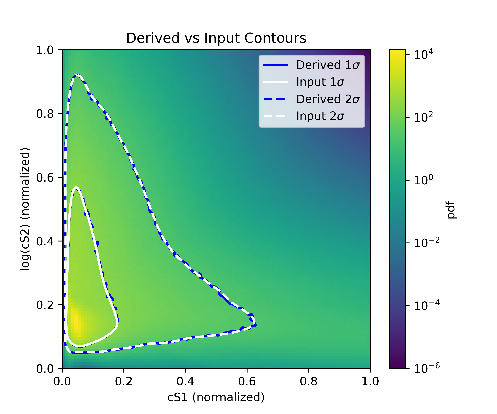 |
| :----------------------------------------------------------: |
| **Fig. 2.1:** Template generated with the Gaussian-like profile, and the comparison between the input contours and the derived contours from the template. The white lines are the input 1$\sigma$/2$\sigma$ contours; the blue lines are the derived contours from our Gaussian‐like template. |

### Piecewise-uniform Profile

Surface backgrounds (e.g., from radon daughter decays on detector walls) feature lower S2 area due to charge loss, and are important especially in XENONnT SR0. The distribution of these events in the cS1-cS2 space is not clear, and it may not have a single peak, as required in the Gaussian-like profile. In this case it is simplest to assume a piecewise-constant (uniform) density inside the contours. This “flat” approximation is easy to implement and has no extra shape parameters beyond the two areas.

We still call the $1\sigma$ region $\Sigma_1$, and the $2\sigma$ region $\Sigma_2$. Assume the following probability density function:
$$
f(x,y) \;=\;
  \begin{cases}
    c_{0}, & (x,y)\in \Sigma_{1},\\
    c_{1}, & (x,y)\in \Sigma_{2}\setminus\Sigma_{1},\\
    0,     & (x,y)\notin \Sigma_{2}.
  \end{cases}
$$
Note that we have assumed that no events would appear outside the $2\sigma$ contour. This is because we have to set a hard cut-off, as the events can't go to infinity, and $\Sigma_2$ is a natural choice. 

We still enforce that 68% of all events would lie inside $\Sigma_1$. The two constants $c_0$ and $c_1$ are easily determined by:
$$
c_1 = 0.68/A_1, \qquad c_2 = 0.32/(A_2-A_1)
$$
where $A_1 =  \mathrm{Area}(\Sigma_1)$, $A_2 = \mathrm{Area}(\Sigma_2)$.

### Contour-band Profile (PandaX-4T AC)

The PandaX-4T accidental-coincidence template is built from the digitized $1\sigma/2\sigma$ AC contours of [[15]](#pandax_prl), extracted in the $(cS1, \log_{10}(cS2_b/cS1))$ analysis space (`notebooks/pandax4t_ac_template.ipynb`). Two features of these contours rule out the Gaussian-like ray-from-peak method (and a naive contour closure):

1. The published contours are **open arcs** anchored to the left edge of the ROI ($cS1 = 2$ PE). A straight auto-closure produces a spurious diagonal that can even clip part of the $1\sigma$ region.
2. The Run1 $1\sigma$ region is **bimodal** — it has a secondary lobe in the upper-left corner — which the single-peak ansatz cannot represent.

We therefore use a **contour-band** template, which generalizes the piecewise-uniform profile to open, multi-piece contours:

1. **Close and combine.** Each arc is closed by routing along the left ROI edge ($cS1 = 2$), and the interior masks are built with `matplotlib.path`. For Run1 the $1\sigma$ region is the **union** of its two lobes, and the $2\sigma$ region is forced to contain the $1\sigma$ region.
2. **Regularize.** On a sub-sampled grid, each region is cleaned up with a morphological closing (to bridge the zigzag of the digitized boundary), filling of self-intersection holes, and a Gaussian smoothing of the boundary followed by a threshold. The regularization scales are fixed in physical units ($\sim 0.74$ PE $\times\ 0.105$ in $\log_{10}(cS2_b/cS1)$ for the closing, $\sim 0.30$ PE $\times\ 0.05$ for the smoothing), so the result is independent of the analysis binning; the procedure is order-agnostic, which makes it robust to the dirty, self-intersecting $2\sigma$ contour.
3. **Assign a band density.** A piecewise-constant density is set so the enclosed probabilities match the contour levels, following the same $1\sigma\to0.68$, $2\sigma\to0.95$ convention as the XENONnT AC template, with the remaining $5\%$ spread uniformly over the rest of the ROI:
   $$
   f(x,y) = \begin{cases}
     0.68/A_1, & (x,y)\in\Sigma_1,\\
     (0.95-0.68)/(A_2-A_1), & (x,y)\in\Sigma_2\setminus\Sigma_1,\\
     0.05/(A_{\mathrm{ROI}}-A_2), & (x,y)\notin\Sigma_2,
   \end{cases}
   $$
   where $A_1$, $A_2$, and $A_{\mathrm{ROI}}$ are the areas of $\Sigma_1$, $\Sigma_2$, and the full ROI. Unlike the piecewise-uniform surface template, a non-zero tail is kept outside $\Sigma_2$, matching the XENONnT AC convention.
4. **Bin and normalize.** The fine-grid density is integrated onto the analysis binning and normalized. By construction the density level sets are the input contours, so the model reproduces them up to the (coarse, $\sim 3$-bin-wide) analysis binning.

The resulting templates (`diamx/data/pandax4t_run{0,1}_ac_template.h5`) are loaded directly as the AC component of the PandaX-4T model (see the PandaX-4T Run0 & Run1 section).

## Statistical Inference with Profiled Likelihood Ratio and Asymptotic Limits

In this section we describe the definition of the profiled likelihood ratio, and how Wilk's theorem [[8]](#) is used to derive confidence intervals and discovery significances. We follow the notations and formulas from [[9]](#asymptotic_formulas).

### Parameters of Interest and Nuisance Parameters

The input of `diamx` is a signal spectrum in events/ton/year as a function of recoil NR energy. The signal can be scaled linearly to reflect stronger signal strength. The scaling parameter is the parameter of interest in `diamx`, for which we will define upper/lower limits and discovery significances. The scaling parameter is also known as the signal rate multiplier in `diamx` or `alea` language, and is related to the total cross section. For example, we can calculate the spin-independent WIMP spectrum, assuming a total cross section of $1\times 10^{-44} \text{cm}^2$. If the best-fit scaling parameter is $0.01$, then it corresponds to a best-fit total cross section of $1\times 10^{-46}\text{cm}^2$. In this section the signal rate multiplier is denoted as $\mu$.

The parameters besides the signal rate multiplier are called nuisance parameters. There are several types of nuisance parameters in usual WIMP search, like the shape parameters, background rate parameters, and efficiency. Shape parameters affect the shape of ER or NR band, or the distribution in corrected S1-S2 space for ER or NR events. Background rate parameters affect the number of detected events from a specific background, and efficiency affects the number of detected events from signals. The nuisance parameters are denoted as a vector $\boldsymbol{\theta}$.

Due to lack of input, we only keep the following nuisance parameters:

* **Background rate parameter**: scales the expected number of events from a specific background component. These parameters are usually listed directly in literature.
* **Efficiency**: scales the expected number of events from a signal. In `diamx` we calculate the efficiency uncertainty for each input signal spectrum, and allows the signal efficiency to change according to the uncertainty.
* **Shape parameters**: due to lack of input, only $Q_{LL}/Q_{\beta}$ in the LZ WS2024 treatment of 2$\nu$ECEC of $^{124}$Xe is included as a shape parameter. 

### Likelihood and the Profiled Likelihood Ratio

The likelihood function is defined as a product of two terms: one for the WIMP search dataset, and one for ancillary measurements of the nuisance parameters:
$$
\mathcal{L}(\mu. \boldsymbol{\theta}) = \mathcal{L}_{data}(\mu. \boldsymbol{\theta}) \times \mathcal{L}_{anc}(\boldsymbol{\theta})
$$
In usual WIMP studies a term from calibration is usually included, which is dropped in `diamx` because the calibration dataset is not available. 

The first term, $\mathcal{L}_{data}$, is constructed as an unbinned Poisson likelihood as described in [[5]](#xenonnt_analysis_paper_two):
$$
\mathcal{L}_{data}(\mu. \boldsymbol{\theta}) = \mathrm{Pois}\left(N|\mu_{tot}(\mu,\boldsymbol{\theta})\right) \times \prod_{i=1}^{N} \left[\sum_{c}\frac{\mu_{c}(\mu, \boldsymbol{\theta})}{\mu_{tot}(\mu, \boldsymbol{\theta})}\times f_c(\vec{x_i}|\boldsymbol{\theta})\right]
$$
where $N$ is the total number of events in the dataset, $\mu_{tot}(\mu, \boldsymbol{\theta})$ is the expected total number of events with given parameters, $\mathrm{Pois}$ is the probability density function of a Poisson distribution, the index $i$ runs over all $N$ observed events $\vec{x_i}$ in the WIMP search dataset, $\vec{x_i}$ is a vector with entries corrected S1 and corrected S2, $c$ runs over all signal or background components, $\mu_c$ is the expected number of events for the component, $f_c$ is the PDF of the component, and $\mu_{tot}$ is the total expectation value of all components.

The second term, $\mathcal{L}_{anc}$, is constructed as a product of constraint terms for some of the nuisance parameters, where ancillary measurements are available. For simplicity the prior distribution of the nuisance parameters is always assumed to be Gaussian, and the likelihood term is simply the product of Gaussian PDFs.

The construction of the confidence intervals is based on the profiled likelihood test statistic:
$$
t_{\mu} = -2\ln\frac{\mathcal{L}(\mu, \boldsymbol{\hat{\hat{\theta}}}(\mu))}{\mathcal{L}(\hat{\mu}, \boldsymbol{\hat{\theta}})}
$$
Quantities with a single hat denote the global maximum likelihood estimator of a parameter, while $\boldsymbol{\hat{\hat{\theta}}}$ is the set of nuisance parameters that maximize the likelihood if the signal rate multiplier $\mu$ is fixed. 

Because of the physical constraint that the signal rate multiplier $\mu$ must be larger than 0, we can define an alternative test statistic:
$$
\tilde{t}_{\mu} = \begin{cases}
-2\ln\frac{\mathcal{L}(\mu, \boldsymbol{\hat{\hat{\theta}}}(\mu))}{\mathcal{L}(\hat{\mu}, \boldsymbol{\hat{\theta})}}, \hat{\mu}\geq0\\
-2\ln\frac{\mathcal{L}(\mu, \boldsymbol{\hat{\hat{\theta}}}(\mu))}{\mathcal{L}(0, \boldsymbol{\hat{\hat{\theta}}}(0))}, \hat{\mu}<0
\end{cases}
$$

In `diamx` $\tilde{t}_{\mu}$ is calculated instead of $t_{\mu}$.

### Asymptotic Behavior

From a result of Wald [[10]](#wald), for sufficiently large number of observed events $N$, the test statistic satisfies:
$$
t_{\mu} = \frac{(\mu - \hat{\mu})^2}{\sigma^2} + \mathcal{O}(1/\sqrt{N})
$$
Here $\hat{\mu}$ follows a Gaussian distribution with a mean $\mu^{\prime}$ and standard deviation $\sigma$. With the $\mathcal{O}(1/\sqrt{N})$ term dropped, the probability density function of the statistic $t(\sigma)$ approaches a $\chi^2$ distribution with degree of freedom 1. This is known as Wilk's theorem [[8]](#wilks_theorem).
$$
f\left(t_{\mu}|\mu\right) = \frac{1}{\sqrt{2\pi}} \frac{1}{\sqrt{t_{\mu}}}e^{-t_{\mu}/2}
$$
However, the distribution of $\tilde{t}_{\mu}$ is more complicated:
$$
f(\tilde{t}_{\mu}|\mu^\prime=\mu) = \begin{cases}
\frac{1}{\sqrt{2\pi}} \frac{1}{\sqrt{\tilde{t}_{\mu}}}e^{-\tilde{t}_{\mu}/2},\quad \tilde{t}_{\mu} \leq \mu^2/\sigma^2 \\
\frac{1}{2}\frac{1}{\sqrt{2\pi}} \frac{1}{\sqrt{\tilde{t}_{\mu}}}e^{-\tilde{t}_{\mu}/2} + \frac{1}{\sqrt{2\pi} (2\mu/\sigma)}\mathrm{exp}\left[-\frac{1}{2}\frac{(\tilde{t}_{\mu}+\mu^2/\sigma^2)^2}{(2\mu/\sigma)^2}\right], \quad  \tilde{t}_{\mu} > \mu^2/\sigma^2
\end{cases}
$$
In `diamx` we use the test statistic $\tilde{t}_{\mu}$, and estimate $\sigma$ with an Asimov dataset (`exact_asymptotic=True`).

### Confidence Intervals

Denote $\Phi(x)$ as the cumulative distribution of the standard (zero mean, unit variance) Gaussian, and one can obtain the cumulative distribution of $t_{\mu}$ from asymptotic equations:
$$
F(t_{\mu}|\mu) = 2\Phi(\sqrt{t_\mu})-1
$$
We can then define p-values:
$$
p_{\mu} = 1 - F(t_{\mu}|\mu) = 2(1-\Phi(\sqrt{t_{\mu}}))
$$
The confidence intervals are defined as the range of $\mu$ with p-values larger than $1-\alpha$, where $\alpha$ is a specified threshold, which is usually 90% in WIMP searches. 

### Discovery Significances

The discovery significance uses another test statistic which is also based on profiled likelihood ratio:
$$
q_{0} = \begin{cases}
-2\ln\frac{\mathcal{L}(0, \boldsymbol{\hat{\hat{\theta}}}(0))}{\mathcal{L}(\hat{\mu}, \boldsymbol{\hat{\theta})}}, \hat{\mu}\geq0\\
0, \hat{\mu}<0
\end{cases}
$$
One can show that in the asymptotic limit the PDF of $q_0$ has the form:
$$
f(q_0|\mu^\prime=0)=\frac{1}{2}\delta(q_0) + \frac{1}{2} \frac{1}{\sqrt{2\pi}} \frac{1}{\sqrt{q_0}} e^{-q_0/2}
$$
which is a mixture of a delta function and a chi-square distribution for one degree of freedom, with each term having a weight of 1/2. 

The cumulative distribution is simply:
$$
F(q_0|\mu^\prime=0)=\Phi(\sqrt{q_0})
$$
The p-value of the $\mu=0$ hypothesis is:
$$
p_0 = 1 - F(q_0|\mu^\prime=0)
$$
If we define the discovery significance $Z$ as $Z=\Phi^{-1}(1-p)$, then one obtains the simple formula:
$$
Z_0 = \sqrt{q_0}
$$

## Experiment-specific Models

### XENONnT SR0

We analyze events in the cS1-cS2 space (photo-electrons, PE). In [[1]](#xenonnt_sr0), there are five backgrounds modeled: **ER**, **neutrons**, **CE$\nu$NS**, **AC**, and **surface**.

First, we argue that the **CE$\nu$NS** background can be neglected, because it only contributes to $0.23 \pm 0.06$ events in the ROI, and only $0.022 \pm 0.006$ events are signal-like, compared to 152 observed events in the ROI and 3 signal-like events. In addition, the **CE$\nu$NS** background consists mainly of low-energy NR events, where a good model is not available.

The remaining four backgrounds are modeled:

* The ER background is modeled by a flat spectrum.
* The neutron background uses the input spectrum from [[11]](#xenonnt_sensitivity).
* The AC background model uses a Gaussian-like profile contour-driven method.
* The surface background model is constructed with a piecewise-uniform profile.

The `diamx` model does not take into account the $r$ information of events, nor does it distinguish between far-wire and near-wire regions.

Fig. 2 shows the comparison between the contours from literature and the contours drawn with `diamx`. We can see that while the ER contours match reasonably well, there is a mismatch at the low-energy tail of neutron events. This means that the NR model in `diamx` is invalid at low energy. 

| 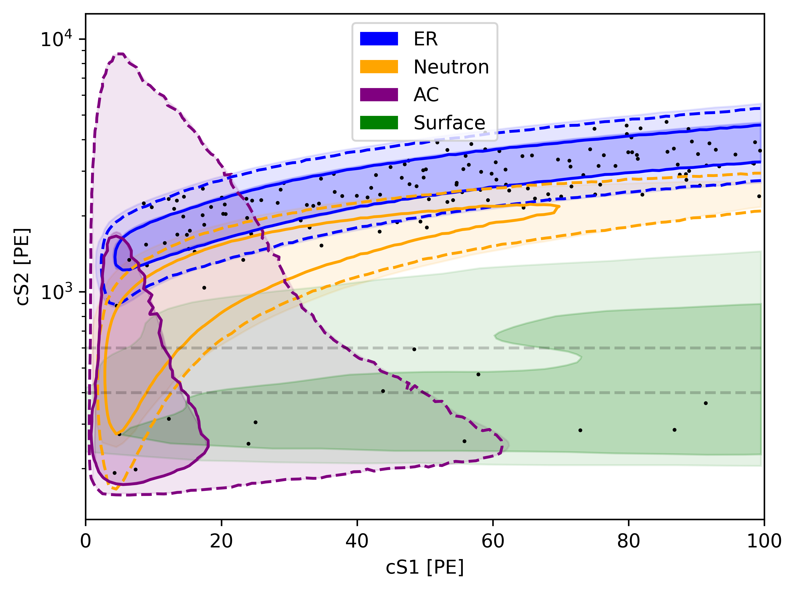 |
| :----------------------------------------------------------: |
| **Fig. 4.1:** The contours for different backgrounds modeled in `diamx` for XENONnT SR0. The pie charts show the digitized events extracted from [[1]](#xenonnt_sr0), and the respective fraction of the components. Dark and light, blue, orange, purple and green shading show the regions containing 68% and 95% of the events from ER, neutron, AC and surface, respectively. The shading comes from Fig. 3 in [[1]](#xenonnt_sr0). Note that the 68% contour for the neutron background is not available. The solid and dashed lines of the same color show the same quantiles calculated with `diamx`. The figure also shows a horizontal dashed line corresponding to cS2=400PE, below which the NR model is not valid, shown by the apparent discrepancy between literature contours and `diamx` contours. |

To deal with this problem, we add another ROI cut and require that the events should have cS2 > 400PE. This cut also has the benefit of reducing effects from surface and AC events, where the model in `diamx` may not be accurate. 

Table 4.1 shows the nominal and best-fit expected number of events for each model component from literature and from `diamx`. Note that because we have added an extra ROI cut, the nominal rate of AC and surface events have been replaced by a placeholder value in `diamx`. Fig. 3 shows the upper limit on spin-independent WIMP-nucleon cross section at 90% confidence level as a function of the WIMP mass. We can see that the values are in agreement with literature values for WIMP mass > 30 GeV/c${}^2$.

**Table 4.1:** Expected number of events for each model component. The “nominal” columns show expectation values and uncertainties before fitting, and the "best-fit" columns show best-fit expectation values and uncertainties for a free fit including a 200 GeV/c${}^2$ WIMP signal component. The values in the "literature" column comes from Tab. I of [[1]](#xenonnt_sr0), while the  `diamx` columns contain results calculated from `diamx`.

| Component Name | Nominal (literature) | Nominal (`diamx`) | Best fit (literature) | Best fit (`diamx`) |
| :------------: | :------------------: | :---------------: | :-------------------: | :----------------: |
|       ER       |        $134$         |       $134$       |   $135^{+12}_{-11}$   |    $134 \pm 12$    |
|    Neutron     | $1.1^{+0.6}_{-0.5}$  |    $1.1\pm0.5$    |     $1.1 \pm 0.4$     |   $1.1 \pm 0.5$    |
|   CE$\nu$NS    |   $0.23 \pm 0.06$    |        --         |    $0.23 \pm 0.06$    |         --         |
|       AC       |    $4.3 \pm 0.9$     | $1$ (placeholder) |  $4.4^{+0.9}_{-0.8}$  |   $0.0 \pm 0.7$    |
|    Surface     |      $14 \pm 3$      | $1$ (placeholder) |      $12 \pm 2$       |   $3.0 \pm 1.7$    |
|      WIMP      |          --          |        --         |         $2.6$         |       $3.2$        |

| 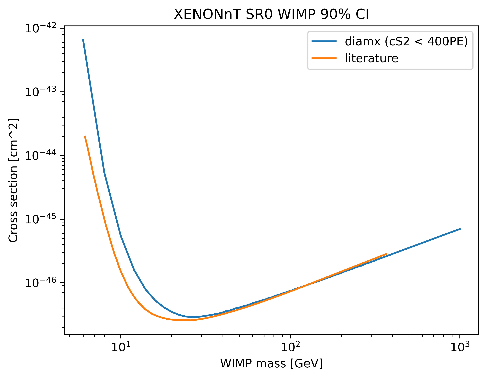 |
| :----------------------------------------------------------: |
| **Fig. 4.2:** Upper limit on spin-independent WIMP-nucleon cross section at 90% confidence level as a function of the WIMP mass from the XENONnT SR0 results. The orange line shows the literature value without applying power constraints, and the blue line shows the upper limit from `diamx`. |

### XENONnT SR1

In [[2]](#xenonnt_sr1), the entire SR1 was divided into two periods, SR1a and SR1b, because of different background levels. Both periods share the same micro-physics and detector parameters. 

There are two main differences between the SR0 model and the SR1 models:

* The surface background is largely suppressed with a tighter fiducial volume cut, and now the nominal expected number of events from surface is only $0.43 \pm 0.05$ $(0.77 \pm 0.09)$ in SR1a(b). This background is further cut by our ROI cut (cS2 > 400PE). Because the number of events are subdominant, and the our piecewise uniform model is inaccurate, we decided not to put this background in our model.
* The ER background is no longer well represented by a flat spectrum, because of elevated tritium and ${}^{37}$Ar concentrations. Like in literature, in SR1a we added a tritium-like term and a ${}^{37}$Ar term, and in SR1b we added a tritium-like term. The spectrum of the tritium term is extracted from KATRIN [[12]](#katrin_tritium). For ${}^{37}$Ar two mono-energetic peaks are considered: 2.82keV (K-shell, 90.2%) and 0.27keV (L-shell, 8.7%).

Fig. 4.3 shows the comparison between the contours from literature and the contours drawn with `diamx` for XENONnT SR1a and SR1b. After adjusting $g_2$ the ER contours match perfectly well with published contours, while the mismodeling in cS2 < 400PE is still visible.

| 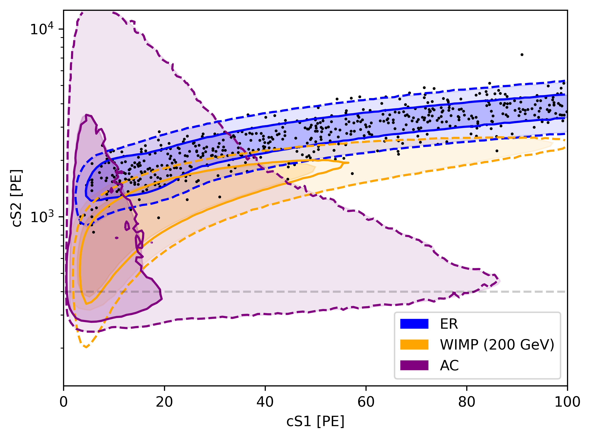  |
| :----------------------------------------------------------: |
| **Fig. 4.3:** The contours for different backgrounds / signal modeled in `diamx` for XENONnT SR1a (left), and XENONnT SR1b (right). Pie charts show the digitized events extracted from [[2]](#xenonnt_sr1), and the fractions of different components in the best-fit model. Dark and light, blue, red and purple shading show the regions containing 68% and 95% of the events from ER, 200 GeV/c${}^2$ WIMP and AC, respectively. The shading comes from Fig. 2 in [[2]](#xenonnt_sr1). The solid and dashed lines of the same color show the same quantiles calculated with `diamx`. |

Table 4.2a-c shows the comparison between expected number of events from literature and from `diamx`. The results agree well, except for deviations in ${}^3$H like and ${}^{37}$Ar components in SR1a and SR1b, which are still within uncertainty and likely caused by loss of events when extracting data points. Fig. 5 shows the upper limit for spin-independent WIMP-nucleon cross section at a 90% confidence level. The `diamx` upper limit agrees well with literature values at WIMP mass larger than 50 GeV/c${}^2$. 

**Table 4.2a:** Expected number of events for each model component for XENONnT SR0, from a combined fit of SR0 & SR1 results. The “nominal” columns show expectation values and uncertainties before fitting, and the "best-fit" columns show best-fit expectation values and uncertainties for a free fit including a 200 GeV/c${}^2$ WIMP signal component. The values in the "literature" column comes from Tab. I of [[2]](#xenonnt_sr1), while the  `diamx` columns contain results calculated from `diamx`.

|     Component Name      | Nominal (literature) | Nominal (`diamx`) | Best fit (literature) | Best fit (`diamx`) |
| :---------------------: | :------------------: | :---------------: | :-------------------: | :----------------: |
|        ER (flat)        |        $134$         |       $134$       |     $136 \pm 12$      |    $135 \pm 12$    |
|    ER (${}^3$H like)    |          --          |        --         |          --           |         --         |
|    ER (${}^{37}$Ar)     |          --          |        --         |          --           |         --         |
|         Neutron         |    $0.7 \pm 0.3$     |    $0.7\pm0.3$    |     $0.6 \pm 0.3$     |   $0.7 \pm 0.3$    |
|    CE$\nu$NS (solar)    |   $0.16 \pm 0.05$    |        --         |    $0.16 \pm 0.05$    |         --         |
| CE$\nu$NS (atm. + DSNB) |   $0.04 \pm 0.02$    |        --         |    $0.04 \pm 0.02$    |         --         |
|           AC            |    $4.3 \pm 0.9$     | $1$ (placeholder) |  $4.4^{+0.9}_{-0.8}$  |   $0.0 \pm 0.7$    |
|         Surface         |      $14 \pm 3$      | $1$ (placeholder) |      $12 \pm 2$       |   $3.0 \pm 1.7$    |
| WIMP (200 GeV/c$^{2}$)  |          --          |        --         |         $1.8$         |       $1.8$        |

**Table 4.2b:** Expected number of events for each model component for XENONnT SR1a, from a combined fit of SR0 & SR1 results. 

|     Component Name      | Nominal (literature) | Nominal (`diamx`) | Best fit (literature) | Best fit (`diamx`) |
| :---------------------: | :------------------: | :---------------: | :-------------------: | :----------------: |
|        ER (flat)        |     $430 \pm 30$     |   $430 \pm 30$    |     $450 \pm 20$      |    $460 \pm 30$    |
|    ER (${}^3$H like)    |         $62$         |       $62$        |      $40 \pm 30$      |    $20 \pm 30$     |
|    ER (${}^{37}$Ar)     |      $58 \pm 6$      |    $58 \pm 6$     |      $55 \pm 5$       |     $53 \pm 5$     |
|         Neutron         |   $0.47 \pm 0.19$    |   $0.47\pm0.19$   |    $0.45 \pm 0.19$    |  $0.47 \pm 0.19$   |
|    CE$\nu$NS (solar)    |  $0.010 \pm 0.003$   |        --         |   $0.010 \pm 0.003$   |         --         |
| CE$\nu$NS (atm. + DSNB) |  $0.024 \pm 0.012$   |        --         |   $0.024 \pm 0.012$   |         --         |
|           AC            |   $2.12 \pm 0.18$    |  $2.12 \pm 0.18$  |    $2.10 \pm 0.18$    |  $2.11 \pm 0.18$   |
|         Surface         |   $0.43 \pm 0.05$    |        --         |    $0.42 \pm 0.05$    |         --         |
| WIMP (200 GeV/c$^{2}$)  |          --          |        --         |         $1.1$         |       $1.2$        |

**Table 4.2c:** Expected number of events for each model component for XENONnT SR1b, from a combined fit of SR0 & SR1 results. 

|     Component Name      | Nominal (literature) | Nominal (`diamx`) | Best fit (literature) | Best fit (`diamx`) |
| :---------------------: | :------------------: | :---------------: | :-------------------: | :----------------: |
|        ER (flat)        |     $151 \pm 11$     |   $151 \pm 11$    |     $154 \pm 10$      |    $156 \pm 10$    |
|    ER (${}^3$H like)    |        $101$         |       $101$       |   $80^{+18}_{-17}$    |    $69 \pm 17$     |
|    ER (${}^{37}$Ar)     |          --          |        --         |          --           |         --         |
|         Neutron         |    $0.7 \pm 0.3$     |    $0.7\pm0.3$    |     $0.7 \pm 0.3$     |   $0.7 \pm 0.3$    |
|    CE$\nu$NS (solar)    |  $0.019 \pm 0.006$   |        --         |   $0.019 \pm 0.006$   |         --         |
| CE$\nu$NS (atm. + DSNB) |   $0.05 \pm 0.02$    |        --         |    $0.05 \pm 0.02$    |         --         |
|           AC            |    $3.8 \pm 0.3$     |   $3.8 \pm 0.3$   |     $3.8 \pm 0.3$     |   $3.8 \pm 0.3$    |
|         Surface         |   $0.77 \pm 0.09$    |        --         |    $0.76 \pm 0.09$    |         --         |
| WIMP (200 GeV/c$^{2}$)  |          --          |        --         |         $2.1$         |       $2.2$        |

| 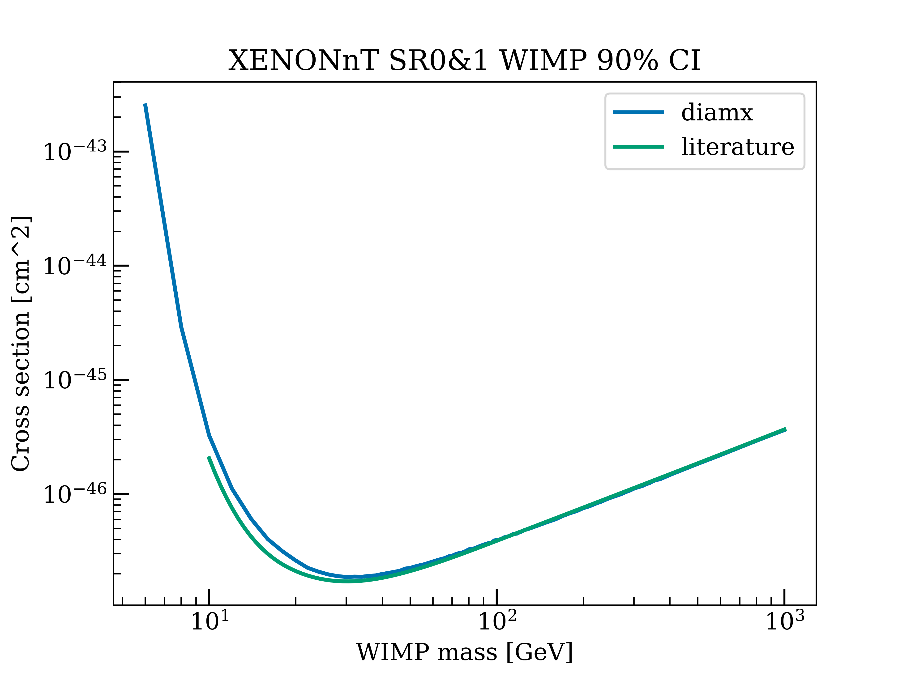 |
| :----------------------------------------------------------: |
| **Fig. 4.4:** Upper limit on spin-independent WIMP-nucleon cross section at 90% confidence level as a function of the WIMP mass from the XENONnT SR0 & 1 results. The orange line shows the literature value without applying power constraints, and the blue line shows the upper limit from `diamx`. The limits matches well at masses above 50 GeV/c${}^2$. |

### LZ WS2022

We analyze events in the S1c-S2c space (photons detected, phd). The ${}^8$B CE$\nu$NS background and the neutron background are neglected in this study because the number of expected events are low. The AC background cannot be modeled because the contours are not published. 

The following background components are modeled:

* $\beta$ decays + Det ER: flat ER spectrum
* $\nu$ ER: flat ER spectrum
* ${}^{127}$Xe: 5.2 keV L-shell electron capture, with lowered charge yield with respect to the beta charge yield of the same energy, $Q_{L}/Q_{\beta}=0.87$, as suggested in LZ WS2024 results [[4]](#lz_ws2024). We didn't find a value used in WS2022; in principle the value could be different because of different electric field configurations between LZ WS2022 & WS2024.
* ${}^{124}$Xe: 10.00 keV LL shell double electron capture (1.4%) and 5.98 keV LM shell double electron capture (0.8%). Both used a lowered charge yield $Q_{L}/Q_{\beta}=0.87$. Although in LZ WS2024 $Q_{LL}/Q_{\beta}$ is even lower (0.70), the effect was not discovered in LZ WS2022 results, so the charge yield was kept the same to be consistent with previous results.
* ${}^{136}$Xe: 2$\nu$bb spectrum, from [nucleartheory.yale.edu](https://nucleartheory.yale.edu/double-beta-decay-phase-space-factors) [[13]](#xe136_double_beta).
* ${}^{37}$Ar: 2.82keV K-shell electron capture (90.2%), 0.27keV L-shell electron capture (8.7%). This component is modeled with the usual beta model.

| 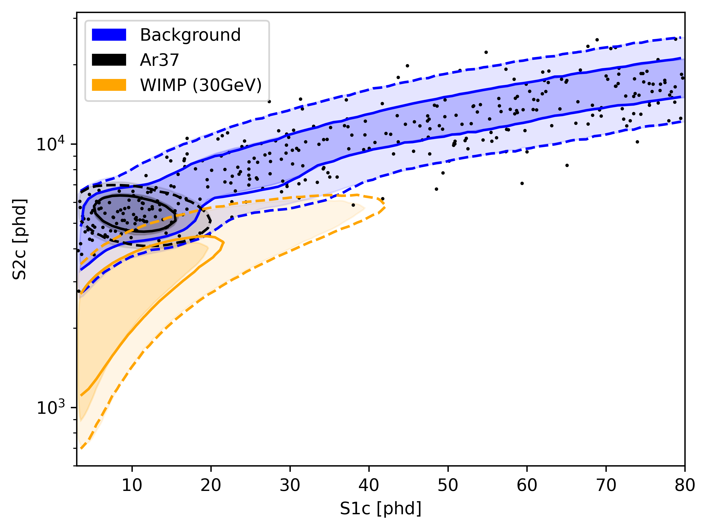 |
| :----------------------------------------------------------: |
| **Fig. 4.5:** The $1\sigma$ and $2\sigma$ contours for different backgrounds modeled in `diamx` for LZ WS2022. Pie charts show the digitized events extracted from [[3]](#lz_ws2022) and the fractions of different components in the best-fit model. Dark and light, blue, green, and red shading show the regions containing 68% and 95% of the events from ER background (best-fit), ${}^{37}$Ar and 30 GeV/c${}^2$ WIMP, respectively. The shading comes from Fig. 4 in [[3]](#lz_ws2022). The solid and dashed lines of the same color show the same quantiles calculated with `diamx`. |

Table 4.3 shows the comparison between expected number of events from literature and from `diamx`, which shows good agreement. Fig. 4.6 shows the upper limit of WIMP-nucleon scattering cross section. The upper limits for WIMP mass larger than 80 GeV/c${}^{2}$ align well with the published results.

**Table 4.3:** Number of events for each model component for LZ WS2022. The “nominal” columns show expectation values and uncertainties before fitting, and the "best-fit" columns show best-fit expectation values and uncertainties for a free fit including a 30 GeV/c${}^2$ WIMP signal component. The values in the "literature" column comes from Tab. I of [[3]](#lz_ws2022), while the  `diamx` columns contain results calculated from `diamx`.

|     Component Name      | Nominal (literature) | Nominal (`diamx`)  | Best fit (literature) | Best fit (`diamx`) |
| :---------------------: | :------------------: | :----------------: | :-------------------: | :----------------: |
| $\beta$ decays + Det ER |     $215 \pm 36$     |    $215 \pm 36$    |     $222 \pm 16$      |    $224 \pm 16$    |
|        $\nu$ ER         |    $27.1 \pm 1.6$    |   $27.1 \pm 1.6$   |    $27.2 \pm 1.6$     |   $27.1 \pm 1.6$   |
|      ${}^{127}$Xe       |    $9.2 \pm 0.8$     |   $9.2 \pm 0.8$    |     $9.3 \pm 0.8$     |   $9.3 \pm 0.8$    |
|      ${}^{124}$Xe       |    $5.0 \pm 1.4$     |   $5.0 \pm 1.4$    |     $5.2 \pm 1.4$     |   $5.3 \pm 1.4$    |
|      ${}^{136}$Xe       |    $15.1 \pm 2.4$    |   $15.1 \pm 2.4$   |    $15.2 \pm 2.4$     |   $15.2 \pm 2.4$   |
|    ${}^8$B CE$\nu$NS    |   $0.14 \pm 0.01$    |         --         |    $0.15 \pm 0.01$    |         --         |
|       Accidentals       |    $1.2 \pm 0.3$     |         --         |     $1.2 \pm 0.3$     |         --         |
|       ${}^{37}$Ar       |      $[0, 288]$      | $50$ (placeholder) | $52.5^{+9.6}_{-8.9}$  |   $50.5 \pm 9.1$   |
|    Detector neutrons    |     $0.0^{+0.2}$     |         --         |     $0.0^{+0.2}$      |         --         |
|   30 GeV/c${}^2$ WIMP   |          --          |         --         |     $0.0^{+0.6}$      |       $0.0$        |

| 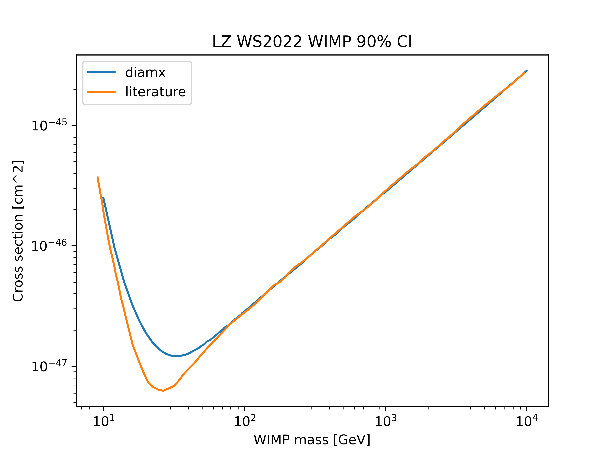  |
| :----------------------------------------------------------: |
| **Fig. 4.6:** Upper limit on spin-independent WIMP-nucleon cross section at 90% confidence level as a function of the WIMP mass from the LZ WS2022 results. The orange line shows the literature value without applying power constraints, and the blue line shows the upper limit from `diamx`. |

### LZ WS2024

For LZ WS2024 we model the following components:

* ${}^{214}$Pb $\beta$s: flat ER spectrum
* ${}^{85}$Kr + ${}^{39}$Ar $\beta$s + det. $\gamma$s: flat ER spectrum
* Solar $\nu$ ER: flat ER spectrum
* ${}^{212}$Pb + ${}^{218}$Po $\beta$s: flat ER spectrum
* Tritium + $^{14}$C $\beta$s: assuming event ratio of 8:1 (introduced by calibration with tritiated methane). Tritium spectrum comes from KATRIN [[12]](#katrin_tritium), and ${}^{14}$C spectrum is calculated with BetaShape [[14]](#beta_shape).
* ${}^{136}$Xe 2$\nu$bb: 2$\nu$bb spectrum, from [nucleartheory.yale.edu](https://nucleartheory.yale.edu/double-beta-decay-phase-space-factors) [[13]](#xe136_double_beta).
* ${}^{124}$Xe DEC: 10.00 keV LL shell double electron capture (1.4%) and 5.98 keV LM shell double electron capture (0.8%). The LM shell double electron capture uses a charge yield ratio of 0.88, while $Q_{LL}/Q_{\beta}$  is treated as a free shape parameter within $[0.65, 0.87]$.
* ${}^{127}$Xe + ${}^{125}$Xe EC: 5.2 keV L-shell electron capture, with lowered charge yield $Q_{L}/Q_{\beta}=0.88$.
* AC: modeled using Gaussian-like profile from contours.

The contours from `diamx` and from literature are compared in Fig. 4.7. 

| 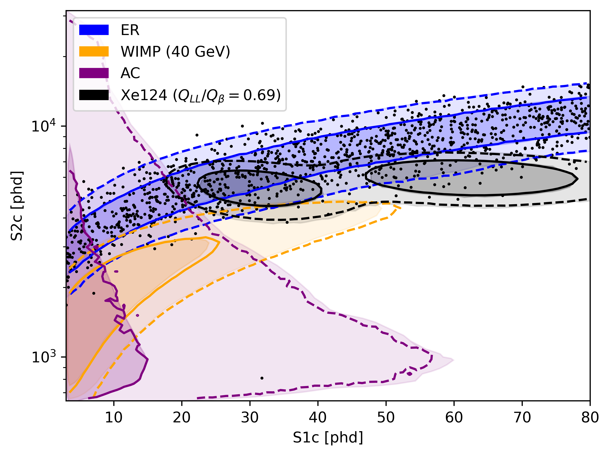 |
| :----------------------------------------------------------: |
| **Fig. 4.7:** The contours for different backgrounds / signal modeled in `diamx` for LZ WS2024. Pie charts show the digitized events extracted from [[4]](#lz_ws2024), and the fractions of different components in the best-fit model. Dark and light, blue, red, purple, and black shading show the regions containing 68% and 95% of the events from ER background (best-fit), 40 GeV/c${}^2$ WIMP, accidental coincidence, and ${}^{124}$Xe (best-fit), respectively. The shading comes from Fig. 3 in [[4]](#lz_ws2024). The solid and dashed lines of the same color show the same quantiles calculated with `diamx`. The contours of the AC template does not fully match because of a different ROI selection. |

Table 4.4 shows the comparison between expected number of events from literature and from `diamx`, which shows good agreement. Fig. 4.8 shows the upper limit of WIMP-nucleon scattering cross section. The upper limit from literature at high WIMP mass is significantly lower than calculated from `diamx`, which is likely caused by lack of radon tagging model in `diamx`. The best-fit $Q_{LL}/Q_{\beta} = 0.69 \pm 0.03$, which agrees with the published result $0.70 \pm 0.04$. 

**Table 4.4:** Number of events for each model component for LZ WS2024 in a combined fit of LZ WS2022 + LZ WS2024. The “nominal” columns show expectation values and uncertainties before fitting, and the "best-fit" columns show best-fit expectation values and uncertainties for a free fit including a 40 GeV/c${}^2$ WIMP signal component. The values in the "literature" column comes from Tab. I of [[4]](#lz_ws2024), while the  `diamx` columns contain results calculated from `diamx`.

|                   Component Name                    | Nominal (literature) | Nominal (`diamx`) | Best fit (literature) | Best fit (`diamx`) |
| :-------------------------------------------------: | :------------------: | :---------------: | :-------------------: | :----------------: |
|                ${}^{214}$Pb $\beta$s                |     $743 \pm 88$     |   $743 \pm 88$    |     $733 \pm 34$      |    $749 \pm 39$    |
| ${}^{85}$Kr + ${}^{39}$Ar $\beta$s + det. $\gamma$s |     $162 \pm 22$     |   $162 \pm 22$    |     $161 \pm 21$      |    $163 \pm 21$    |
|                   Solar $\nu$ ER                    |     $102 \pm 6$      |    $102 \pm 6$    |      $102 \pm 6$      |    $102 \pm 6$     |
|        ${}^{212}$Pb + ${}^{218}$Po $\beta$s         |    $62.7 \pm 7.5$    |  $62.7 \pm 7.5$   |    $63.7 \pm 7.4$     |   $62.8 \pm 7.5$   |
|             Tritium + $^{14}$C $\beta$s             |    $58.3 \pm 3.3$    |  $58.3 \pm 3.3$   |    $59.7 \pm 3.3$     |   $58.4 \pm 3.3$   |
|                ${}^{136}$Xe 2$\nu$bb                |    $55.6 \pm 8.3$    |  $55.6 \pm 8.3$   |    $55.8 \pm 8.2$     |   $55.5 \pm 8.2$   |
|                  ${}^{124}$Xe DEC                   |    $19.4 \pm 3.9$    |  $19.4 \pm 3.9$   |    $21.4 \pm 3.6$     |   $21.5 \pm 3.5$   |
|           ${}^{127}$Xe + ${}^{125}$Xe EC            |    $3.2 \pm 0.6$     |   $3.2 \pm 0.6$   |     $2.7 \pm 0.6$     |   $3.2 \pm 0.6$    |
|               Accidental coincidences               |    $2.8 \pm 0.6$     |   $2.8 \pm 0.6$   |     $2.6 \pm 0.6$     |   $2.6 \pm 0.6$    |
|                    Atm. $\nu$ NR                    |   $0.12 \pm 0.02$    |        --         |    $0.12 \pm 0.02$    |         --         |
|              ${}^8$B + *hep* $\nu$ NR               |   $0.06 \pm 0.01$    |        --         |    $0.06 \pm 0.01$    |         --         |
|                  Detector neutrons                  |     $0.0^{+0.2}$     |        --         |     $0.0^{+0.2}$      |         --         |
|                 40 GeV/c${}^2$ WIMP                 |          --          |        --         |     $0.0^{+0.6}$      |       $0.0$        |

| 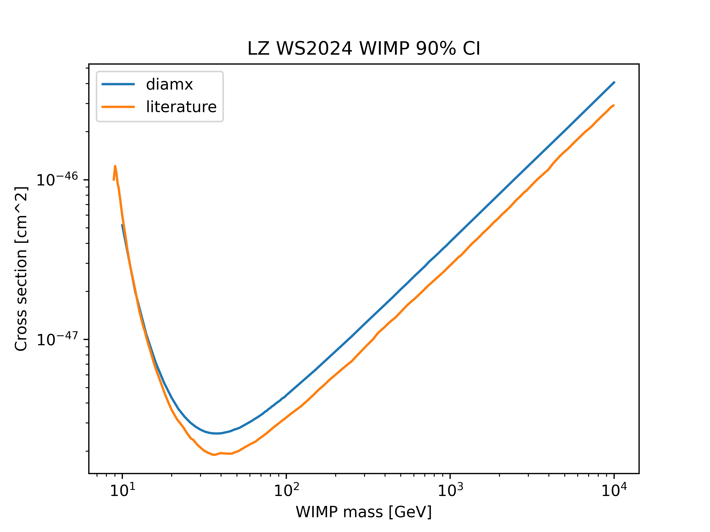  |
| :----------------------------------------------------------: |
| **Fig. 4.8:** Upper limit on spin-independent WIMP-nucleon cross section at 90% confidence level as a function of the WIMP mass from the LZ WS2024 results. The orange line shows the literature value without applying power constraints, and the blue line shows the upper limit from `diamx`. |

### PandaX-4T Run0 & Run1

We analyze the combined Run0 + Run1 dataset (exposures of $0.54$ and $1.00$ tonne$\cdot$year, $1.54$ tonne$\cdot$year in total [[15]](#pandax_prl)) in the $(cS1, \log_{10}(cS2_b/cS1))$ space, where $cS2_b$ is the bottom-array S2. The two runs share the micro-physics functional form but use per-run gains, drift fields, electron-lifetime distributions, and NR recombination coefficients (Tables 1.4–1.5). $1117$ and $1373$ candidate events are observed in Run0 and Run1, respectively [[15]](#pandax_prl).

Following Table I of [[15]](#pandax_prl), we model the following components: **Other ER** (a data-driven, near-flat ER spectrum), **tritium** (CH$_3$T, flat ER), **${}^{124}$Xe** and **${}^{127}$Xe** (mono-energetic ER lines; ${}^{127}$Xe in Run0 only), **neutron** and **${}^8$B CE$\nu$NS** (NR), and **AC**. The ${}^8$B recoil spectrum is taken from the PandaX-4T ${}^8$B CE$\nu$NS measurement [[17]](#pandax_b8), while the neutron recoil spectrum reuses the XENONnT input [[11]](#xenonnt_sensitivity). The surface background ($\lesssim 0.3$ events) is neglected. As in [[15]](#pandax_prl), the tritium rate is left **free** in the fit (PandaX determines it through an unconstrained fit), while the remaining components are Gaussian-constrained to their Table I uncertainties. The AC template is contour-driven (Section 2) from the digitized $1\sigma/2\sigma$ AC contours of [[15]](#pandax_prl).

Fig. 4.9 shows the contour / pie-chart comparison for the two runs. Because the analysis axis is the charge-to-light *ratio*, the published $5\%/95\%$ ER band edges and NR median are overlaid (rather than $1\sigma/2\sigma$ contours) to validate the band shape; Fig. 4.10 shows this comparison in the $(cS1, \log_{10} cS2_b)$ plane, where the diamx ER band and NR median track the published curves across the full cS1 range — the latter requires both the realistic electron lifetime and the high-cS1 joint refit of the NR recombination coefficients.

| 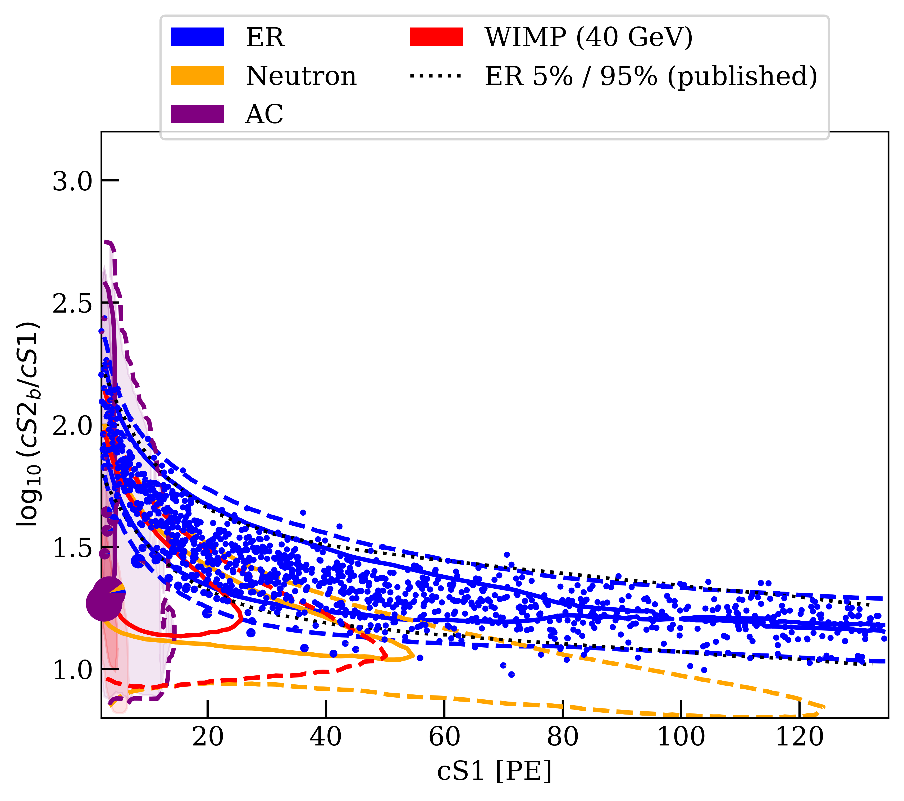 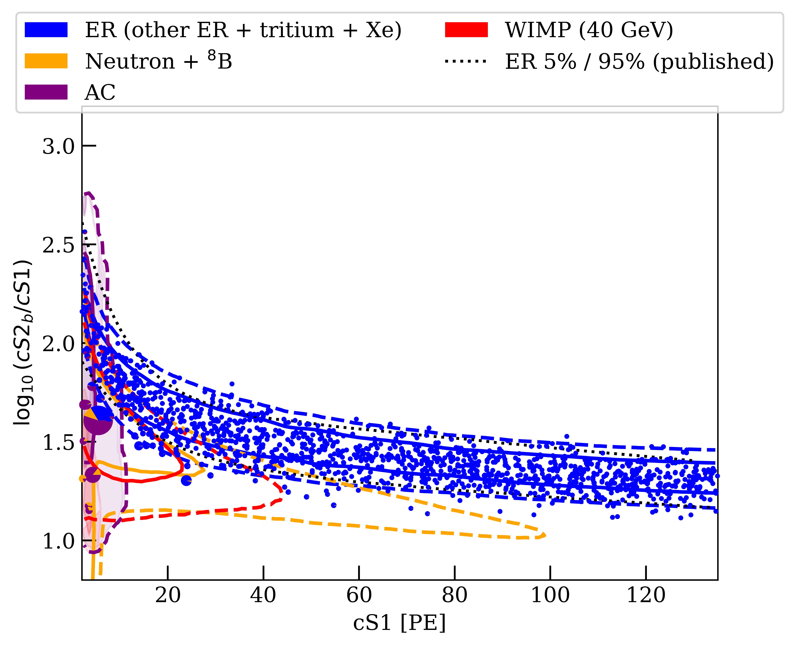 |
| :----------------------------------------------------------: |
| **Fig. 4.9:** The contours for the backgrounds / signal modeled in `diamx` for PandaX-4T Run0 (left) and Run1 (right), in the $(cS1, \log_{10}(cS2_b/cS1))$ space. Pie charts show the digitized candidate events from [[15]](#pandax_prl) and the fractions of different components in the best-fit model. Blue, green, purple, and red contours show the ER (other ER + tritium + Xe), neutron + ${}^8$B, AC, and 40 GeV/c$^2$ WIMP components from `diamx`; the AC and WIMP literature $1\sigma/2\sigma$ contours and the published ER $5\%/95\%$ band edges (black dotted) are overlaid for comparison. |

| 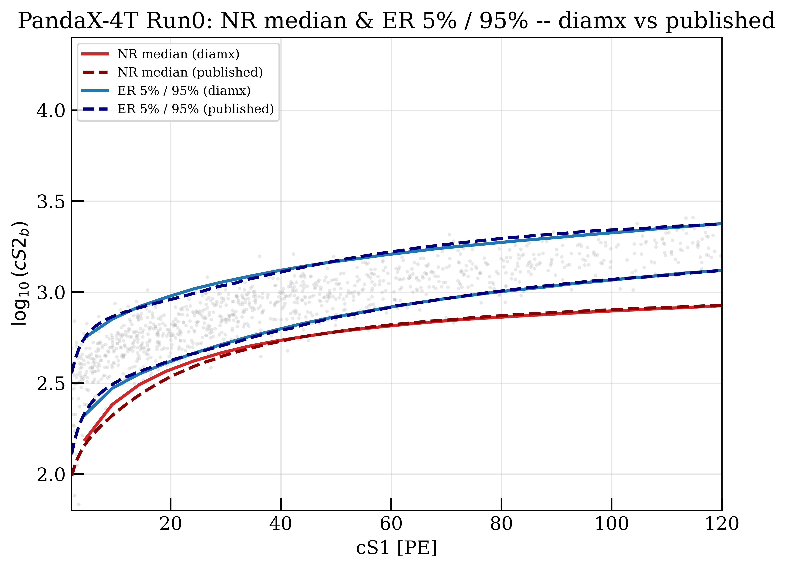 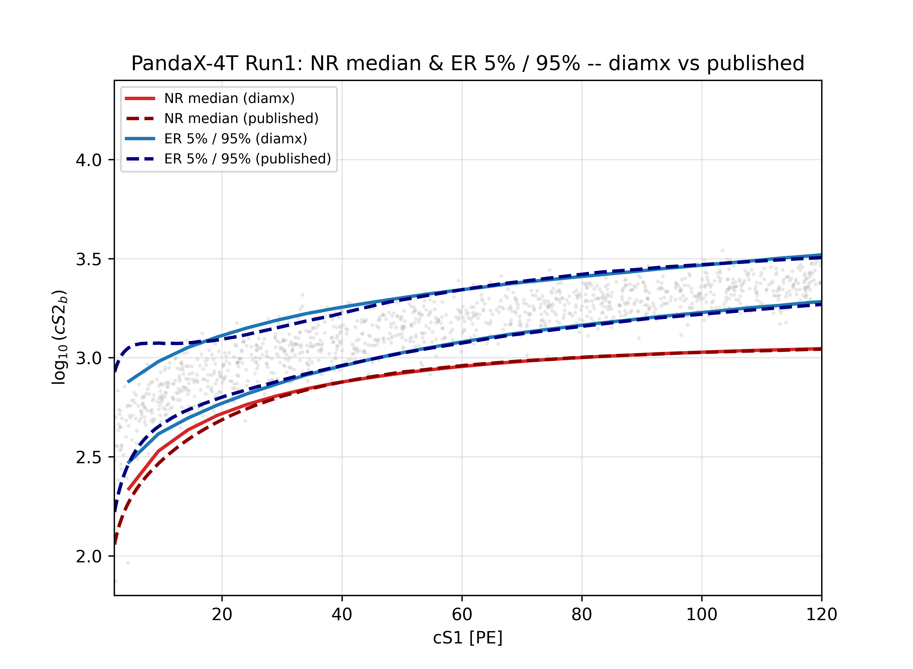 |
| :----------------------------------------------------------: |
| **Fig. 4.10:** NR median and ER $5\%/95\%$ band, `diamx` versus published, for Run0 (left) and Run1 (right), in the $(cS1, \log_{10} cS2_b)$ plane. Solid lines are `diamx`; dashed lines are the digitized published curves of [[15]](#pandax_prl) (red: NR median; blue: ER $5\%/95\%$). Grey points are the candidate events. The agreement across the full cS1 range validates the yield, electron-lifetime, and reconstruction models. |

Tables 4.5a–b compare the nominal and best-fit expected number of events. The agreement is good; PandaX-4T publishes only a *combined* (Run0+Run1) best fit in Table I of [[15]](#pandax_prl), which the `diamx` per-run best fits reproduce when summed (e.g. Other ER $1750$ vs $1767\pm48$, CH$_3$T $660$ vs $677\pm44$, neutron $1.7$ vs $1.6\pm0.8$, AC $23$ vs $26\pm5$). Fig. 4.11 shows the 90% CL upper limit on the spin-independent WIMP-nucleon cross section. The `diamx` limit agrees with the published curve to within $\sim 5\%$ for WIMP masses $\gtrsim 100$ GeV/c$^2$ (the region most relevant for, e.g., inelastic dark matter); near the $\sim 40$ GeV/c$^2$ minimum it lies $\sim 1.5\times$ above the published value, and the discrepancy grows toward low mass (up to $\sim 3\times$ near $15$ GeV/c$^2$), reflecting the low-energy region where the residual low-cS1 NR-median offset and threshold/surface effects are not fully captured.

**Table 4.5a:** Expected number of events for each model component in PandaX-4T Run0, from a combined Run0 + Run1 fit. The “Nominal” column shows the Table I expectation values and uncertainties of [[15]](#pandax_prl) (`diamx` uses the same central rates); the "Best fit (`diamx`)" column shows best-fit expectation values and uncertainties for a free fit including a 40 GeV/c$^2$ WIMP signal. The tritium rate is unconstrained (free) in the fit.

|   Component Name   | Nominal (literature) | Best fit (`diamx`) |
| :----------------: | :------------------: | :----------------: |
|   Other ER (data)  |      $504 \pm 16$    |     $510 \pm 14$   |
|   ${}^3$H (CH$_3$T)|      $556 \pm 33$    |     $570 \pm 30$   |
|    ${}^{124}$Xe    |     $2.3 \pm 0.6$    |    $2.3 \pm 0.6$   |
|    ${}^{127}$Xe    |     $7.7 \pm 0.4$    |    $7.7 \pm 0.4$   |
|      Neutron       |     $0.6 \pm 0.3$    |    $0.6 \pm 0.3$   |
|  ${}^8$B CE$\nu$NS |     $0.3 \pm 0.1$    |   $0.31 \pm 0.10$  |
|        AC          |       $11 \pm 3$     |      $11 \pm 3$    |
| WIMP (40 GeV/c$^2$)|         --           |        $0.0$       |

**Table 4.5b:** Expected number of events for each model component in PandaX-4T Run1, from a combined Run0 + Run1 fit (columns as in Table 4.5a).

|   Component Name   | Nominal (literature) | Best fit (`diamx`) |
| :----------------: | :------------------: | :----------------: |
|   Other ER (data)  |     $1226 \pm 28$    |    $1240 \pm 20$   |
|   ${}^3$H (CH$_3$T)|      $114 \pm 33$    |      $90 \pm 30$   |
|    ${}^{124}$Xe    |     $4.1 \pm 1.1$    |    $4.1 \pm 1.1$   |
|      Neutron       |     $1.1 \pm 0.6$    |    $1.1 \pm 0.6$   |
|  ${}^8$B CE$\nu$NS |     $0.7 \pm 0.2$    |   $0.74 \pm 0.19$  |
|        AC          |       $13 \pm 4$     |      $12 \pm 3$    |
| WIMP (40 GeV/c$^2$)|         --           |        $0.0$       |

| 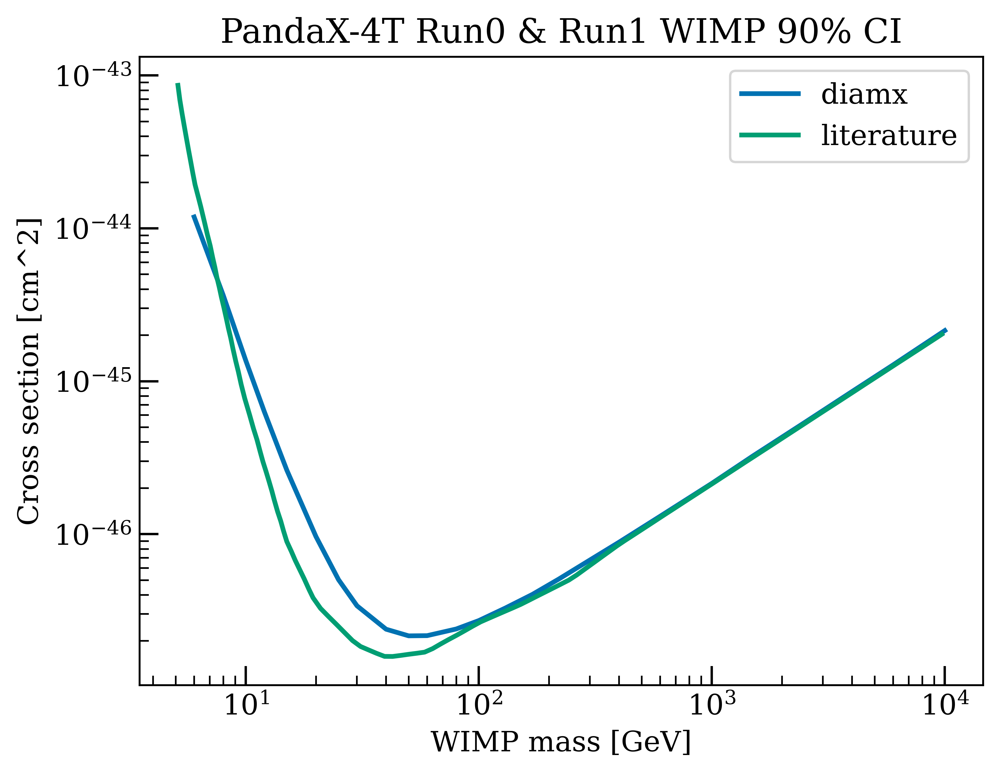 |
| :----------------------------------------------------------: |
| **Fig. 4.11:** Upper limit on the spin-independent WIMP-nucleon cross section at 90% confidence level as a function of the WIMP mass from the combined PandaX-4T Run0 & Run1 results. The orange line shows the literature value [[15]](#pandax_prl) without applying power constraints, and the blue line shows the upper limit from `diamx`. The two agree to within $\sim 5\%$ above $\sim 100$ GeV/c$^2$. |

## References

<a id="xenonnt_sr0">[1]</a> E. Aprile et al., First Dark Matter Search with Nuclear Recoils from the XENONnT Experiment, [Phys. Rev. Lett. **131**, 041003 (2023)](https://doi.org/10.1103/PhysRevLett.131.041003).

<a id="xenonnt_sr1">[2]</a> E. Aprile et al., WIMP Dark Matter Search Using a 3.1 Tonne $\times$ Year Exposure of the XENONnT Experiment, [arXiv:2502.18005](https://doi.org/10.48550/arXiv.2502.18005).

<a id="lz_ws2022">[3]</a> J. Aalbers et al., First Dark Matter Search Results from the LUX-ZEPLIN (LZ) Experiment, [Phys. Rev. Lett. **131**, 041002 (2023)](https://doi.org/10.1103/PhysRevLett.131.041002).

<a id="lz_ws2024">[4]</a> J. Aalbers et al., Dark Matter Search Results from 4.2 Tonne-Years of Exposure of the LUX-ZEPLIN (LZ) Experiment, [arXiv:2410.17036](https://doi.org/10.48550/arXiv.2410.17036).

<a id="xenonnt_analysis_paper_two">[5]</a> E. Aprile et al., XENONnT WIMP Search: Signal & Background Modeling and Statistical Inference, [arXiv:2406.13638](https://doi.org/10.48550/arXiv.2406.13638).

<a id="nest_paper">[6]</a> M. Szydagis et al., A review of NEST models for liquid xenon and an exhaustive comparison with other approaches, [Front. Detect. Sci. Technol. **2**, 1480975 (2025)](https://doi.org/10.3389/fdest.2024.1480975).

<a id="xenonnt_analysis_paper_one">[7]</a> E. Aprile et al., XENONnT analysis: Signal reconstruction, calibration, and event selection, [Phys. Rev. D **111**, 062006 (2025)](https://doi.org/10.1103/PhysRevD.111.062006).

<a id="wilks_theorem">[8]</a> S. S. Wilks, The Large-Sample Distribution of the Likelihood Ratio for Testing Composite Hypotheses, [The Annals of Mathematical Statistics **9**, 60 (1938)](https://doi.org/10.1214/aoms/1177732360).

<a id="asymptotic_formulas">[9]</a> G. Cowan, K. Cranmer, E. Gross, and O. Vitells, Asymptotic formulae for likelihood-based tests of new physics, [Eur. Phys. J. C **71**, 1554 (2011)](https://doi.org/10.1140/epjc/s10052-011-1554-0).

<a id="wald">[10]</a> A. Wald, Tests of statistical hypotheses concerning several parameters when the number of observations is large, [Trans. Amer. Math. Soc. **54**, 426 (1943)](https://doi.org/10.1090/S0002-9947-1943-0012401-3).

<a id="xenonnt_sensitivity">[11]</a> E. Aprile et al., Projected WIMP sensitivity of the XENONnT dark matter experiment, [J. Cosmol. Astropart. Phys. **2020**, 031 (2020)](https://doi.org/10.1088/1475-7516/2020/11/031).

<a id="katrin_tritium">[12]</a> M. Kleesiek et al., $$\upbeta $$-Decay spectrum, response function and statistical model for neutrino mass measurements with the KATRIN experiment, [Eur. Phys. J. C **79**, 204 (2019)](https://doi.org/10.1140/epjc/s10052-019-6686-7).

<a id="xe136_double_beta">[13]</a> J. Kotila and F. Iachello, Phase-space factors for double-${\beta}$ decay, [Phys. Rev. C **85**, 034316 (2012)](https://doi.org/10.1103/PhysRevC.85.034316).

<a id="beta_shape">[14]</a> Mougeot, Atomic exchange correction in forbidden unique beta transitions, [Applied Radiation and Isotopes **201**, 111018 (2023)](https://doi.org/10.1016/j.apradiso.2023.111018).

<a id="pandax_prl">[15]</a> Z. Bo et al. (PandaX Collaboration), Dark Matter Search Results from 1.54 Tonne$\cdot$Year Exposure of PandaX-4T, [Phys. Rev. Lett. **134**, 011805 (2025)](https://doi.org/10.1103/PhysRevLett.134.011805).

<a id="pandax_prd">[16]</a> Y. Luo et al. (PandaX Collaboration), Signal response model in PandaX-4T, [Phys. Rev. D **110**, 023029 (2024)](https://doi.org/10.1103/PhysRevD.110.023029).

<a id="pandax_b8">[17]</a> Z. Bo et al. (PandaX Collaboration), First Indication of Solar Neutrinos through Coherent Elastic Neutrino-Nucleus Scattering in PandaX-4T, [Phys. Rev. Lett. **133**, 191001 (2024)](https://doi.org/10.1103/PhysRevLett.133.191001).